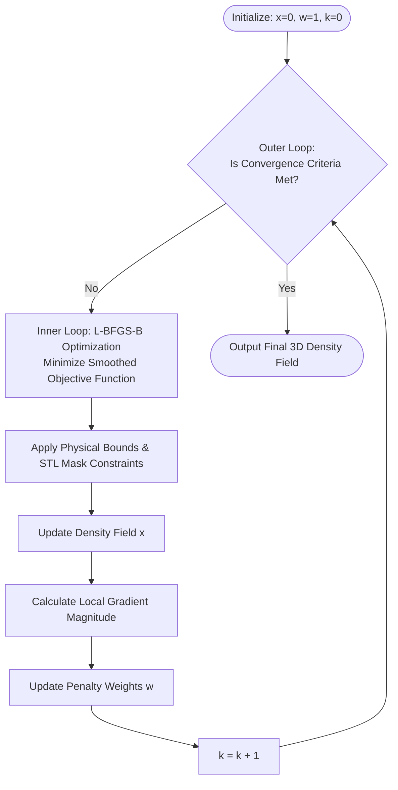

# MuonSTC-TV: Structure-Adaptive Reweighted Total Variation for 3D Muon Tomography

## 📖 Overview
**MuSTC-TV** implements a **Structure-Adaptive Reweighted Total Variation (SA-RTV)** regularization algorithm tailored for 3D reconstruction in cosmic-ray muon transmission imaging. 

This project specifically addresses the highly ill-posed inverse problem caused by **sparse viewpoint constraints** (typically 3 to 5 observation points) in large-scale industrial environments, such as blast furnaces. Standard Total Variation (TV) often suffers from the "staircasing effect," erasing critical gradient structures like the cohesive zone. To overcome this, our SA-RTV algorithm introduces a dynamic spatial weighting mechanism that adapts to local topological and gradient features, effectively suppressing artifacts while preserving the physical boundaries of multiphase flow regions.

---

## ⚙️ Methodology

### 1. The Ill-Posed Problem under Sparse Viewpoints
The physical process of muon transmission is modeled discretely as a linear algebraic system:

$$
\mathbf{y} = \mathbf{A}\mathbf{x} + \mathbf{e}
$$

Where $\mathbf{y}$ is the observation vector, $\mathbf{A}$ is the system projection matrix, and $\mathbf{x}$ is the target 3D density field. Due to physical barriers in industrial sites, the number of effective rays ($M$) is much smaller than the number of voxels ($N$), creating a severely underdetermined system ($M \ll N$). 

### 2. SA-RTV Objective Function
To stabilize the solution, we employ a Bayesian Maximum A Posteriori (MAP) estimation framework, combining a Poisson log-likelihood data fidelity term with the SA-RTV prior:

$$
\Psi(\mathbf{x}) = L(\mathbf{x}) + \lambda \sum_{j=1}^{N} w_j \|\nabla \mathbf{x}_j\|_1
$$

To ensure differentiability for gradient-based solvers, the absolute value operator is replaced with a Charbonnier smoothing approximation:

$$
\Psi_{smooth}(\mathbf{x}) = L(\mathbf{x}) + \lambda \sum_{j=1}^{N} w_j^{(k)} \sqrt{|\nabla \mathbf{x}_j|^2 + \gamma^2}, \quad \text{s.t.} \quad \mathbf{x} \ge 0
$$

---

## 🔄 Algorithm Flowchart

The algorithm utilizes a **Double-Loop Optimization Strategy**: an inner loop solving a smoothed convex optimization problem via L-BFGS-B, and an outer loop updating the spatial weights.



---

## 🏗️ Boundary Constraints and STL Masking

A core feature of `SA-RTV.py` is the use of a 3D CAD model (`Full.stl`) to drastically reduce the search space and enforce physical realism:

* **Geometry Masking (`bf_mask_flat`)**: The STL file is voxelized to create a precise 3D binary mask of the blast furnace. Voxels outside this mask are strictly constrained to 0.0 g/cm³.
* **Morphological Erosion**: The interior mask is further divided into a "shell" and a "core" using binary erosion (`scipy.ndimage.binary_erosion`).
* **Physical Density Bounds**: Based on the material properties, the bounds are dynamically generated. The maximum density is clamped at 5.5 g/cm³.
* **Z-axis Cutoff**: An altitude constraint (`Z_CUTOFF = 10.0`) is applied to zero out densities below the physical probing baseline, further optimizing the L-BFGS-B solver efficiency.

---

## 📂 Input Files Description

To run the reconstruction, the following prerequisite files must be placed in the project root:

| File Name | Description |
| :--- | :--- |
| `SA-RTV.py` | The main execution script containing the SA-RTV algorithm, L-BFGS-B optimizer, and data visualization. |
| `Extracted-Oout-*.txt` | (1-5) Measurement data files containing the 1D flattened arrays of muon opacity derived from the 5 sparse detector viewpoints. |
| `LengthMatrix.npz` | The highly sparse system projection matrix, pre-calculated and stored in `.npz` format. Loaded via `scipy.sparse`. |
| `Full.stl` | The 3D CAD model of the target object (e.g., blast furnace) used for generating boundary constraints and voxel masks. |

---

## 🚀 Usage

**1. Install Dependencies:**

Ensure you have the required Python libraries installed:

```bash
pip install numpy scipy matplotlib trimesh
```

**2. Run the Reconstruction:**

Simply execute the main Python script. The script is configured to perform batch processing over a predefined range of regularization parameters.

```bash
python SA-RTV.py
```

**3. Outputs:**

The script automatically generates a folder named `SA_RTV_Batch_Results_Targeted`, which will contain:
* Raw density matrices (`.txt`) for XZ and YZ cross-sections.
* High-resolution, publication-ready heatmaps (`.png`) formatted to IEEE paper standards.